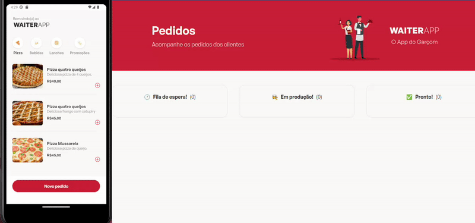

 

   
  
 Essa aplicação tem como finalidade auxiliar restaurantes a controlar seus pedidos, permitindo através de um aplicativo, realizar os pedidos e em tempo real serem enviados para um dashboard web. 
  

     

<h2><strong><em>Aplicativo</em></strong></h2>

 

   
 

<h2><strong><em>Funcionalidades</em></strong></h2>
<ul>
  <li>Criar pedidos.</li>
  <li>Atualizar status dos pedidos.</li>
  <li>Cadastrar/Criar categoria.</li>
  <li>Listar categorias.</li>
  <li>Cadastrar produto.</li>
  <li>Listar todos os produtos.</li>
  <li>Listar produtos por categoria.</li>
  <li>Deletar pedidos.</li>
  <li>Adicionar e remover produtos do carrinho.</li>
</ul>

<h2><strong><em>Tecnologias utilizadas</em></strong></h2>

<ul>
  <li>NodeJs</li>
  <li>ReactJs/Native</li>
  <li>Docker</li>
  <li>Multer</li>
  <li>Typescript</li>
  <li>MongoDB/Mongoose</li>
  <li>Socket.IO</li>
</ul>

<h2><strong><em>Instalação</em></strong></h2>

